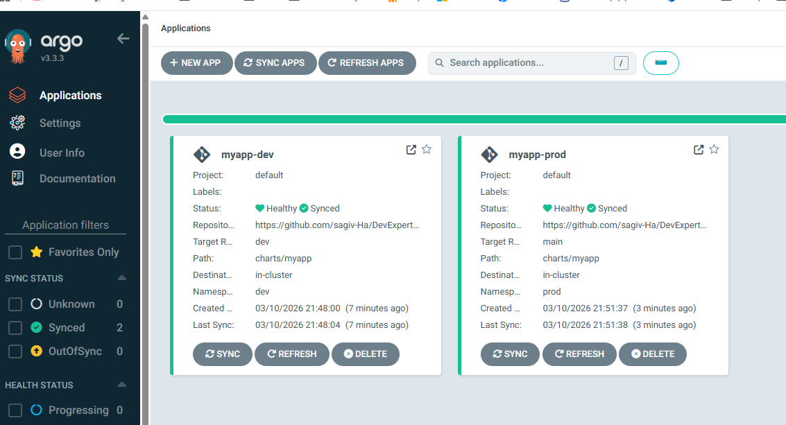
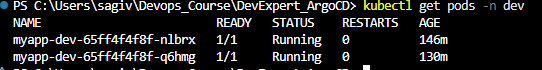
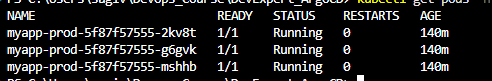

# ArgoCD GitOps Assignment

This repository demonstrates a simple GitOps deployment using ArgoCD and Helm on a Kubernetes cluster (Minikube).

The application is deployed from a GitHub repository and managed by ArgoCD with separate DEV and PROD environments.

---

# Repository Structure

```
DevExpert_ArgoCD
├── charts/myapp/          # Helm chart
├── dev-app.yaml           # ArgoCD DEV application
├── prod-app.yaml          # ArgoCD PROD application
├── screenshots/           # Assignment screenshots
└── README.md
```

---

# Prerequisites

- Kubernetes (Minikube)
- kubectl
- Helm
- ArgoCD

Start Minikube:

```bash
minikube start --cpus=4 --memory=8192
```

Enable ingress:

```bash
minikube addons enable ingress
```

Verify cluster:

```bash
kubectl get nodes
```

---

# Install ArgoCD

Create namespace:

```bash
kubectl create namespace argocd
```

Install ArgoCD:

```bash
kubectl apply -n argocd \
-f https://raw.githubusercontent.com/argoproj/argo-cd/stable/manifests/install.yaml
```

Verify installation:

```bash
kubectl get pods -n argocd
```

---

# Access ArgoCD UI

```bash
kubectl port-forward svc/argocd-server -n argocd 8080:443
```

Open:

```
https://localhost:8080
```

Get admin password:

```bash
kubectl -n argocd get secret argocd-initial-admin-secret \
-o jsonpath="{.data.password}" | base64 -d
```

---

# Deploy Applications

Deploy DEV environment:

```bash
kubectl apply -f dev-app.yaml
```

Deploy PROD environment:

```bash
kubectl apply -f prod-app.yaml
```

Verify deployments:

```bash
kubectl get pods -n dev
kubectl get pods -n prod
```

---

# ArgoCD Applications

Application manifests:

- dev-app.yaml
- prod-app.yaml

The Helm chart used by the applications is located in:

```
charts/myapp
```

---

# Screenshots

### ArgoCD Applications



### DEV Pods



### PROD Pods



---

# GitOps Workflow

1. Configuration is stored in GitHub.
2. ArgoCD monitors the repository.
3. When changes are pushed, ArgoCD detects them.
4. Helm renders Kubernetes manifests from the chart.
5. ArgoCD synchronizes the cluster with the desired state in Git.

This ensures the Kubernetes cluster always matches the configuration stored in Git.

---

# Explanation

## How ArgoCD Connects to GitHub

ArgoCD uses Git repositories as the source of truth for application configuration.

The ArgoCD component responsible for accessing Git repositories is called **argocd-repo-server**.  
This component clones the repository defined in the Application manifest and checks out the specified revision (branch, tag, or commit).

If the repository is public, ArgoCD can clone it directly.  
If the repository is private, credentials are stored securely in Kubernetes Secrets and used by ArgoCD when accessing the repository.

Once the repository is cloned, ArgoCD reads the application configuration and prepares the manifests for deployment.

---

## How Helm Rendering Works

Helm is used in this project to package the Kubernetes application as a Helm chart.

A Helm chart contains:

- Chart.yaml – chart metadata
- values.yaml – default configuration values
- templates/ – Kubernetes resource templates

When ArgoCD deploys a Helm application, it runs Helm in template mode.  
Helm replaces variables inside the templates using the values files (for example values-dev.yaml or values-prod.yaml).

The result of this process is a set of standard Kubernetes manifests such as Deployments and Services.

These manifests are then applied to the Kubernetes cluster by ArgoCD.

---

## How Reconciliation Works

Reconciliation is the core mechanism behind GitOps.

ArgoCD continuously compares two states:

Desired state → configuration stored in Git  
Live state → resources currently running in the Kubernetes cluster

If there is a difference between these two states, the application is marked as **OutOfSync**.

Because automated synchronization is enabled in this project, ArgoCD automatically updates the cluster to match the desired state.

Two important options are used:

**selfHeal: true**  
If someone manually changes a resource in the cluster, ArgoCD detects the drift and restores the configuration defined in Git.

**prune: true**  
If a resource is removed from the repository, ArgoCD removes it from the cluster as well.

This process ensures that the cluster always reflects the configuration stored in Git.